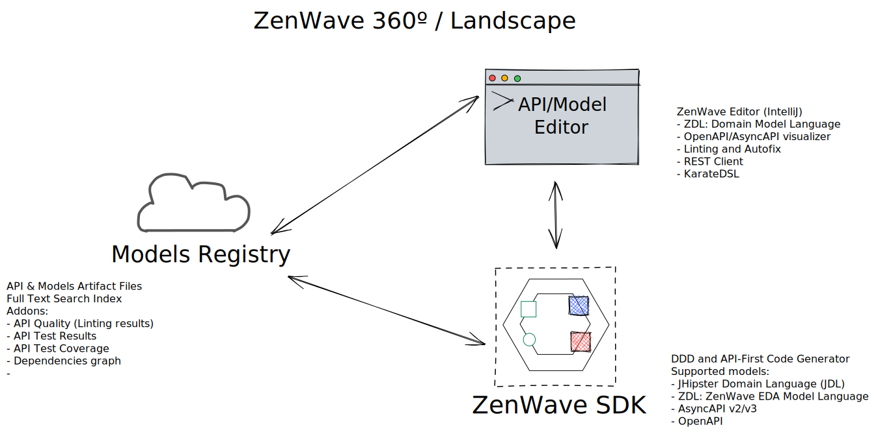

# ZenWave 360 - Landscape

> Work-in-progress

## ZenWave Code Generator

> Work-in-progress

(badges)

ZenWave Code Generator is a configurable and extensible code generator tool for **Domain Driven Design (DDD)** and **API-First** that can generate code from a mix of different models including:

- JHipster Domain Language (JDL)
- AsyncAPI
- OpenAPI

https://github.com/zenwave360/zenwave-code-generator

## ZenWave Editor

Comming soon...

Available:

- [ZenWave KarateIDE](https://github.com/ZenWave360/karate-ide)
- [ZenWave ApiMock](https://github.com/ZenWave360/zenwave-apimock)
- [Karate+OpenAPI PetStore Contract Testing](https://github.com/ZenWave360/karate-openapi-petstore) complete source code.

## ZenWave API Registry

Comming soon...

- API & Models Artifact Files
- Full Text Search Index
- Addons:
  - API Quality (Linting results)
  - API Test Results
  - API Test Coverage
  - Dependencies graph
  -
