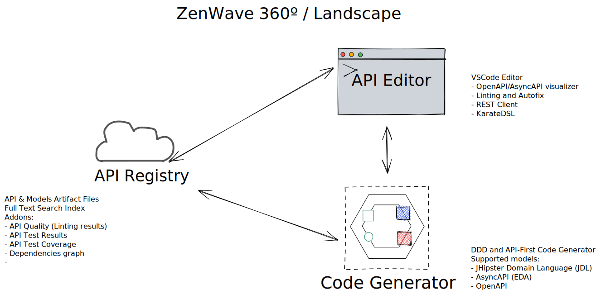

# ZenWave 360 - Landscape

> Work-in-progress

## ZenWave Code Generator

[Zen Wave Code Generator](https://github.com/zenwave360/zenwave-code-generator) 

ZenWave Code Generator is a configurable and extensible code generator tool for **Domain Driven Design (DDD)** and **API-First** that can generate code from a mix of different models including:

- JHipster Domain Language (JDL)
- AsyncAPI
- OpenAPI

## ZenWave Editor

- ZenWave Visual Studio Code API Editor 
  - JDL Editor and visulizer
  - OpenAPI/AsyncAPI visualizer
  - Linting and Autofix
  - REST Client
- [ZenWave KarateIDE for visual studio code](https://github.com/ZenWave360/karate-ide) 
- [ZenWave ApiMock](https://github.com/ZenWave360/zenwave-apimock) 
- [Karate+OpenAPI PetStore Contract Testing](https://github.com/ZenWave360/karate-openapi-petstore) complete source code. 

## ZenWave API Registry

- API & Models Artifact Files
- Full Text Search Index
- Addons:
  - API Quality (Linting results)
  - API Test Results
  - API Test Coverage
  - Dependencies graph
  -
